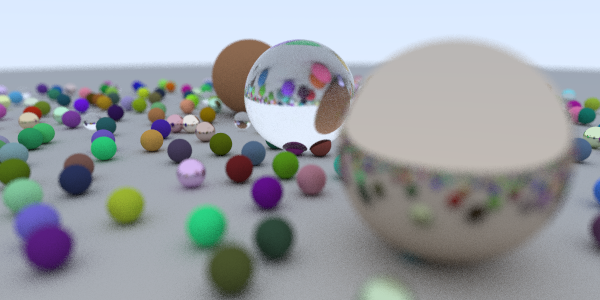

# Weekend Raytracer

This is a Rust implementation of the code from 
[Raytracing in One Weekend][raytracing-in-one-weekend].

[raytracing-in-one-weekend]: https://raytracing.github.io/books/RayTracingInOneWeekend.html

Here's the final image of the tutorial (image 13-1) produced by this raytracer:

# Building

    cargo build

# Running

`main` will output a ppm file to stdout, so if you want a png, you can do this:

    cargo run --release > out.ppm && convert out.ppm out.png
